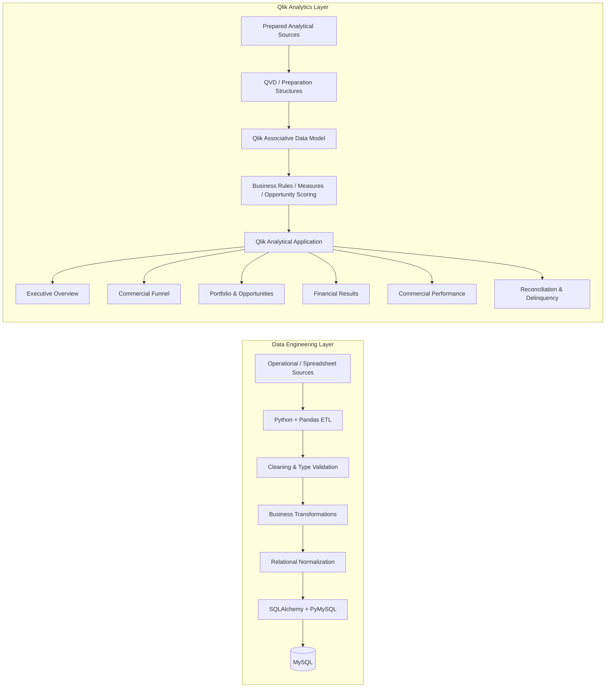

# Architecture

## Overview

This portfolio case documents two complementary components from the credit-operations solution:

1. a **data-engineering layer** built with Python, Pandas, SQLAlchemy / PyMySQL, and MySQL;
2. a **Qlik analytics layer** built from prepared analytical datasets, QVD structures, associative modeling, business rules, and dashboards.

The public documentation intentionally keeps these components distinct. It does **not** claim a directly validated automated lineage from the MySQL staging layer into the QVD layer unless that connection is explicitly documented and verified.

## Architecture view

## 1. Data engineering layer

The operational source contained credit contracts, proposals, customer information, financial values, rates, commissions, release data, organizational attributes, and other business fields.

Python and Pandas were used to clean and structure source data before relational loading. Practical work included:

- source-column validation;
- data-type conversion;
- null and empty-string treatment;
- numeric and date preparation;
- preservation of business keys;
- normalization of repeated spreadsheet columns;
- creation of relational output structures.

A representative example was preserving contract identifiers as text because the business key can contain characters such as hyphens and slashes.

The transformed datasets were loaded into MySQL through SQLAlchemy / PyMySQL for structured storage and validation.

## 2. Qlik analytical preparation

The Qlik application uses prepared analytical datasets organized through QVD-based structures and intermediate analytical tables.

The analytical model covers domains such as:

- contracts;
- proposals;
- customers and portfolio relationships;
- managers and regional structures;
- targets;
- opportunities;
- financial measures;
- reconciliation events.

## 3. Business rules and analytical logic

The semantic layer converts prepared data into decision-oriented indicators, including:

- production and financial KPIs;
- proposal-funnel metrics;
- SLA analysis;
- target and gap analysis;
- opportunity maturity and recurrence signals;
- opportunity scoring and priority classification;
- estimated financial potential;
- reconciliation exposure and exception monitoring.

## 4. Business consumption

The final Qlik application is organized into six analytical views:

1. Executive Overview
2. Commercial Funnel
3. Portfolio & Opportunities
4. Financial Results
5. Commercial Performance
6. Reconciliation & Delinquency

Together, these views move from executive monitoring to operational and commercial action.

## Design principles

- Preserve business identifiers correctly
- Validate data before relational loading
- Normalize spreadsheet-style structures
- Keep data-engineering and analytical layers clearly separated
- Avoid unsupported lineage claims in public documentation
- Convert operational data into action-oriented business signals
- Protect personal and confidential information in public evidence
