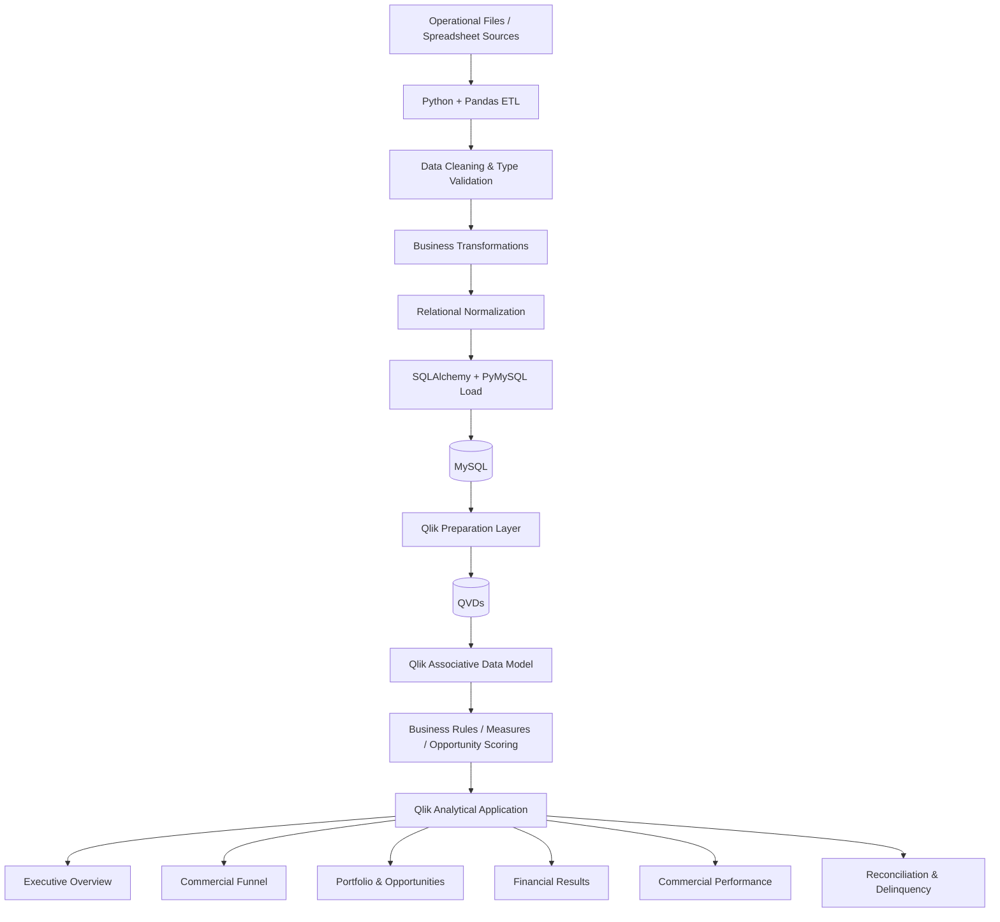

# Architecture

## Overview

This project combines a data engineering pipeline with a Qlik analytical application for credit operations.

The architecture separates operational ingestion, transformation, relational storage, analytical preparation, associative modeling, business rules, and analytical consumption.

## End-to-end architecture

This diagram represents the portfolio architecture documented across the project's data-engineering and analytical layers.

## Architecture layers

### 1. Operational source layer

The operational source contains credit contracts, proposals, customer information, financial values, rates, commissions, release data, organizational attributes, and other business fields.

The public portfolio does not include the original confidential dataset. Dashboard values shown in the published evidence are simulated.

### 2. ETL layer

Python and Pandas were used to clean and structure source data before relational loading.

Key responsibilities included:

- source column validation
- data type conversion
- null handling
- numeric normalization
- date preparation
- business key preservation
- repeated-column normalization
- creation of relational output structures

A key example was preserving contract identifiers as text because the business key can contain characters such as hyphens and slashes.

### 3. Relational database layer

The transformed datasets were loaded into MySQL through SQLAlchemy / PyMySQL.

The relational layer provides a structured foundation for data validation and downstream analytical preparation.

### 4. Analytical preparation layer

The Qlik application uses prepared analytical datasets through QVD-based structures.

This layer separates preparation from dashboard consumption and organizes facts, dimensions, intermediate structures, targets, performance datasets, opportunities, and reconciliation data.

### 5. Qlik associative model

The Qlik model connects multiple business domains and supports cross-analysis between:

- contracts
- proposals
- customers and portfolio relationships
- managers
- regional structures
- targets
- opportunities
- financial measures
- reconciliation events

### 6. Business rules and analytical logic

The semantic layer converts prepared data into business indicators and actionable signals, including:

- production and financial KPIs
- proposal funnel metrics
- SLA analysis
- target and gap analysis
- opportunity maturity and recurrence signals
- opportunity scoring and priority classification
- estimated financial potential
- reconciliation exposure and exception monitoring

### 7. Business consumption layer

The final Qlik application provides six analytical views:

1. Executive Overview
2. Commercial Funnel
3. Portfolio & Opportunities
4. Financial Results
5. Commercial Performance
6. Reconciliation & Delinquency

Together, these views move from executive monitoring to operational and commercial action.

## Design principles

- Preserve business identifiers correctly
- Validate data before database loading
- Normalize spreadsheet-style structures
- Separate preparation from presentation
- Avoid duplicated metrics across analytical layers
- Convert operational data into action-oriented business signals
- Protect personal and confidential information in public documentation
