# Screenshot Evidence

## Purpose

This folder contains a curated set of sanitized screenshots from the Qlik application.

The objective is to demonstrate the analytical design and business coverage without publishing personal data, confidential identifiers, or internal company information. The values shown in these public screenshots are simulated.

The application is represented here by **six analytical dashboards, with two complementary screenshots for each dashboard**.

## 1. Executive Overview

The first screen presents the high-level management view with production, contracts, customers, revenue, commission, recurrence, monthly evolution, and operation mix.

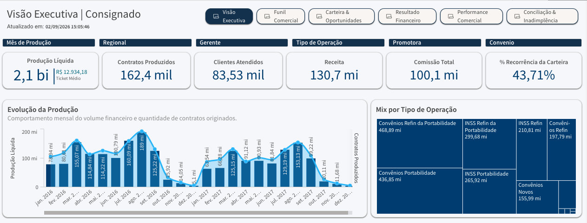

The second screen complements the executive view with regional performance, target attainment, and target-gap analysis.

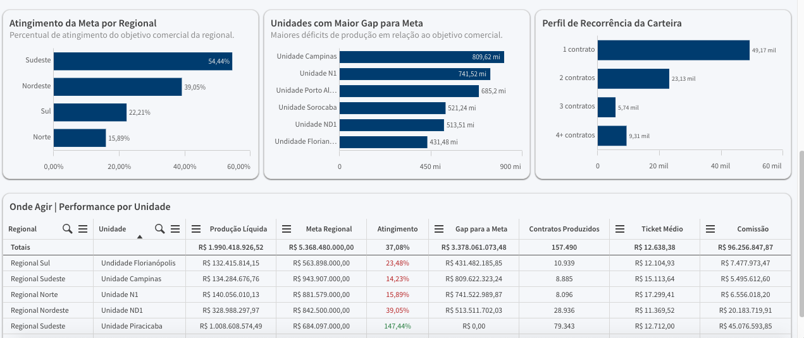

## 2. Commercial Funnel

The first screen presents proposal volume, decision and approval rates, non-converted value, in-progress value, and SLA indicators.

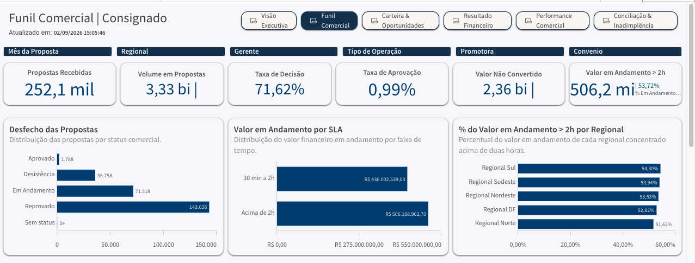

The second screen expands the funnel analysis with manager-level priorities and operational follow-up.

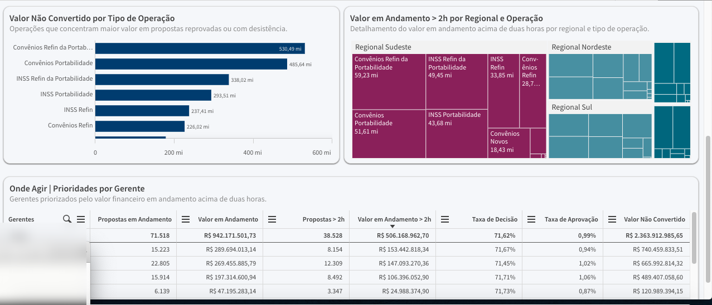

## 3. Portfolio & Opportunities

The first screen presents qualified opportunities, estimated financial potential, high-priority opportunities, portfolio potential, regional distribution, and capture simulation.

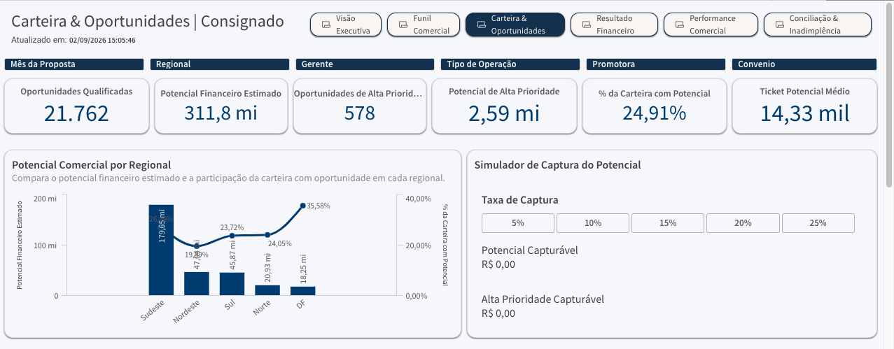

The second screen presents the action-oriented opportunity radar based on maturity, recurrence, time since last contract, estimated potential, and priority classification.

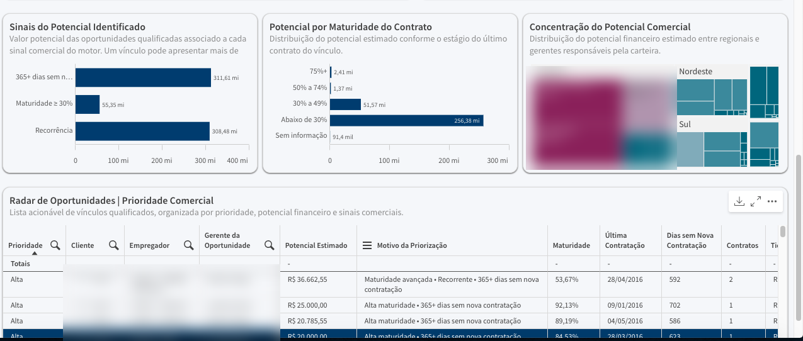

## 4. Financial Results

The first screen presents net production, estimated revenue, total commission, commission-to-production ratio, spread, CET, and comparative financial analysis.

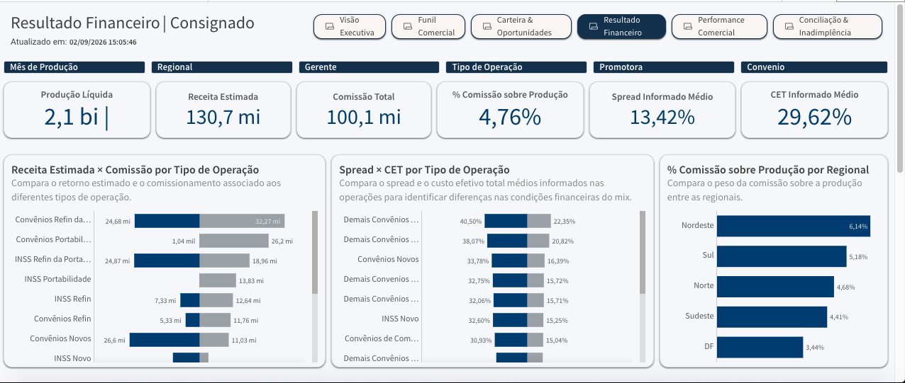

The second screen expands the analysis with financial detail by operation and commercial partner.

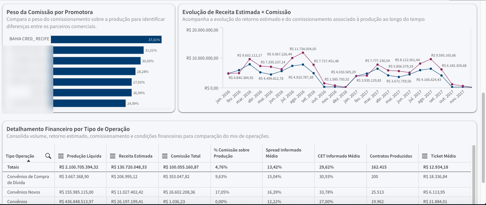

## 5. Commercial Performance

The first screen combines realized production, funnel efficiency, approval rate, non-converted value, and portfolio opportunity potential.

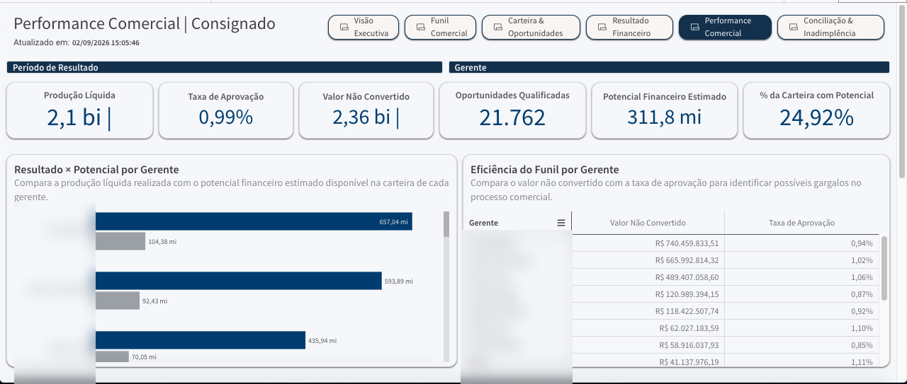

The second screen complements the analysis with a performance radar and manager-level prioritization view.

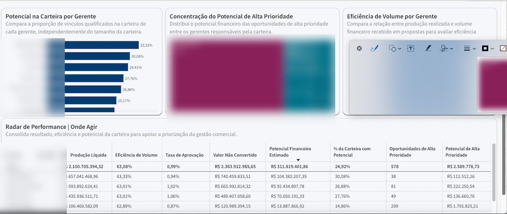

## 6. Reconciliation & Delinquency

The first screen presents expected, discounted, and transferred amounts, reconciliation rate, financial exposure, failures, overdue contracts, and root causes of financial divergence.

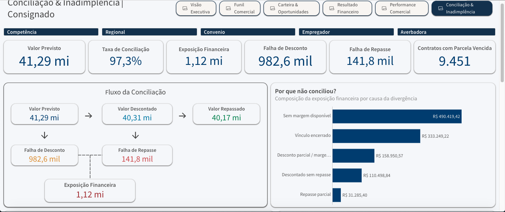

The second screen complements the view with reconciliation evolution, aging of overdue exceptions, entity performance, and operational follow-up indicators.

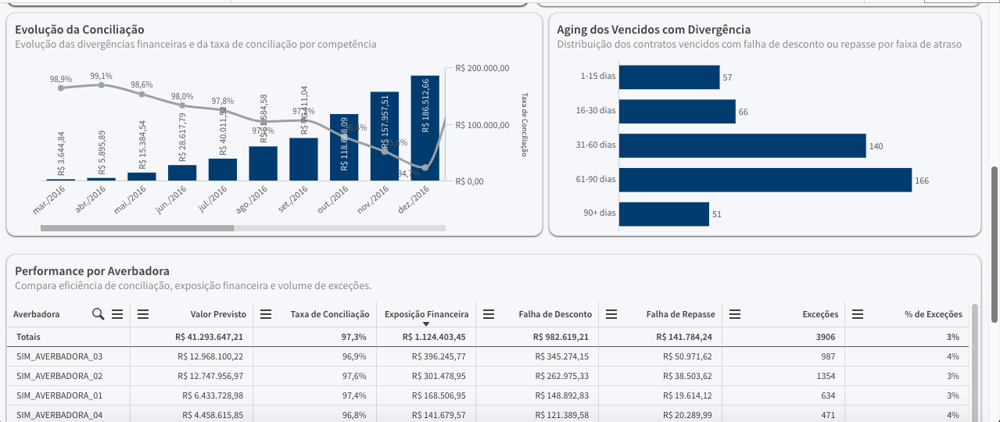

## Sanitization applied

Before publication, the evidence set was reviewed to reduce exposure of unnecessary identifying information. The public versions include measures such as:

- removal of the Qlik tenant/company/user header;
- masking or blurring of visible personal names where required;
- masking of record-level identifying information where required;
- exclusion of credentials, connection information, and internal infrastructure identifiers;
- use of simulated analytical values for the public portfolio case.

## Evidence strategy

The twelve screenshots preserve the two-screen structure of each analytical dashboard while keeping the public case focused on business value, analytical design, and decision support.
